# REdI Data Platform — Database Specification

## Document Control

| Field | Value |
|-------|-------|
| Version | 1.0.0 |
| Date | 2026-02-04 |
| Status | Draft |
| Database | PostgreSQL 16 (Azure Flexible Server) |
| Extensions | TimescaleDB, pg_cron, tablefunc, pgcrypto |

---

## 1. Design Principles

1. **Staff payroll ID is the universal join key** across training, course, faculty, and escalation domains. All staff-related tables reference `staff.id` via payroll-based lookup.
2. **Snapshot imports create versioned records** — each weekly/daily import is tagged with an `import_id` so current and historical state can be reconstructed.
3. **Patient data is de-identified at source** — only hashed URNs and age bands are stored; no names, DOBs, or full admission numbers leave the government tenant.
4. **Aggregates are materialised on import** — pre-computed rollups by time period, org unit, and discipline power the dashboards; granular data is retained for audit and ad-hoc analysis.
5. **Enumerations use lookup tables** rather than PostgreSQL ENUMs, allowing runtime additions without migrations.
6. **Soft deletes via `is_active` flags** — records are never physically deleted from dimension tables.
7. **All timestamps are AEST (UTC+10)** stored as `TIMESTAMPTZ` — the hospital operates in a single timezone and does not observe daylight saving.

---

## 2. Extensions

```sql
CREATE EXTENSION IF NOT EXISTS timescaledb;
CREATE EXTENSION IF NOT EXISTS pg_cron;
CREATE EXTENSION IF NOT EXISTS tablefunc;    -- crosstab for reverse-pivot
CREATE EXTENSION IF NOT EXISTS pgcrypto;     -- gen_random_uuid(), digest() for hashing
```

---

## 3. Schema Namespaces

| Schema | Purpose |
|--------|---------|
| `core` | Shared dimensions: staff, org units, locations |
| `training` | Certification status, course bookings, faculty, feedback |
| `clinical` | Inpatient census, transfers, deaths (de-identified) |
| `escalation` | Pager messages, parsed escalation events |
| `agg` | Pre-computed aggregates for dashboards |
| `system` | Import log, data quality, configuration |

---

## 4. Entity-Relationship Overview

```
┌─────────────────────────────────────────────────────────────────────┐
│                          CORE SCHEMA                                │
│                                                                     │
│  ┌──────────────┐    ┌──────────────┐    ┌───────────────────┐     │
│  │  org_units    │◄───│ tracking_    │    │     staff         │     │
│  │              │    │ group_members│    │  (payroll_id PK)  │     │
│  │  id (PK)     │    └──────────────┘    └────────┬──────────┘     │
│  │  parent_id   │◄─┐                              │                │
│  │  directorate │  │  ┌──────────────┐            │                │
│  │  service_line│  └──│ tracking_    │            │                │
│  └──────┬───────┘     │ groups       │            │                │
│         │             └──────────────┘            │                │
│  ┌──────┴───────┐                                 │                │
│  │    wards     │    ┌──────────────┐            │                │
│  └──────┬───────┘    │ admitting_   │            │                │
│         │            │ units        │            │                │
│         │            └──────┬───────┘            │                │
│  ┌──────┴────────────────────┴───────┐            │                │
│  │      ward_unit_map               │            │                │
│  └───────────────────────────────────┘            │                │
└───────────────────────────────────────────────────┼────────────────┘
                                                    │
        ┌───────────────────────┬───────────────────┼──────────────┐
        │                       │                   │              │
        ▼                       ▼                   ▼              ▼
┌───────────────┐  ┌────────────────┐  ┌────────────────┐  ┌──────────┐
│   TRAINING    │  │   CLINICAL     │  │  ESCALATION    │  │   AGG    │
│               │  │                │  │                │  │          │
│ certifications│  │ inpatient_     │  │ pager_messages │  │ training │
│ courses       │  │   census       │  │ escalation_    │  │ census   │
│ participants  │  │ transfers      │  │   events       │  │ escalat. │
│ faculty       │  │ deaths         │  │                │  │ deaths   │
│ feedback      │  │                │  │                │  │ transfer │
│ elearning     │  │                │  │                │  │          │
│ bls_dropin    │  │                │  │                │  │          │
└───────────────┘  └────────────────┘  └────────────────┘  └──────────┘
```

---

## 5. Lookup / Enumeration Tables

These tables replace hard-coded ENUMs. Each has `id SERIAL PRIMARY KEY`, `code VARCHAR UNIQUE NOT NULL`, `label VARCHAR NOT NULL`, `sort_order INT DEFAULT 0`, `is_active BOOLEAN DEFAULT TRUE`.

### 5.1 `system.lookup_certification_status`

Derived from actual data in ALS/BLS certification reports.

| code | label | is_compliant |
|------|-------|-------------|
| `acquired` | Acquired | true |
| `overdue` | Overdue | false |
| `assigned` | Assigned | false |
| `expired` | Expired | false |
| `in_progress` | In Progress | false |
| `not_assigned` | Not Assigned (derived) | false |

### 5.2 `system.lookup_booking_status`

From Participants.csv `BookingStatus` field.

| code | label | counts_as_attended |
|------|-------|--------------------|
| `finalised` | Finalised | true |
| `attended` | Attended | true |
| `completed` | Completed | true |
| `enrolled` | Enrolled | false |
| `booked` | Booked | false |
| `did_not_attend` | Did Not Attend | false |
| `further_assessment` | Further Assessment Required | false |
| `cancel_request` | Cancel Request | false |
| `rejected` | Rejected | false |

### 5.3 `system.lookup_course_type`

From Events.csv `CourseType` field.

| code | label |
|------|-------|
| `full_course` | Full Course |
| `assessment` | Assessment |
| `refresher` | Refresher |
| `anzca_refresher` | ANZCA Refresher |
| `sim_workshop` | Sim Workshop |

### 5.4 `system.lookup_course_status`

| code | label |
|------|-------|
| `open` | Open |
| `closed` | Closed |
| `cancelled` | Cancelled |

### 5.5 `system.lookup_discipline_stream`

Unified across all datasets. The source systems use inconsistent naming; this table normalises them.

| code | label | source_variants |
|------|-------|-----------------|
| `medical` | Medical | "Medical" |
| `nursing` | Nursing & Midwifery | "Nursing & Midwifery", "Nursing or Midwifery", "Nursing" |
| `allied_health` | Allied Health / Health Practitioner | "Health Practitioner", "Allied Health", "Health Practitioners" |
| `admin` | Administrative / Clerical | "Managerial and Clerical" |
| `other` | Other / Unknown | "none", "" |

### 5.6 `system.lookup_job_family`

From ALS/BLS cert `Job Family Name`. Mapped to parent `discipline_stream`.

| code | label | discipline_stream_code |
|------|-------|----------------------|
| `medical` | Medical | `medical` |
| `visiting_medical` | Visiting Medical Staff | `medical` |
| `rn_cn_5_6` | Registered / Clinical Nurse Gr 5-6 | `nursing` |
| `en_3_4` | Enrolled Nurses Gr 3-4 | `nursing` |
| `ain_1_2` | Assistant In Nursing Gr 1-2 | `nursing` |
| `nm_7_8` | Nurse Manager Gr 7-8 | `nursing` |
| `ne_9_13` | Nurse Executive Gr 9-13 | `nursing` |
| `health_prac` | Health Practitioners | `allied_health` |
| `health_clin_asst` | Health Clinical Assistants | `allied_health` |
| `admin_clerical` | Managerial and Clerical | `admin` |

### 5.7 `system.lookup_escalation_type`

From pager message classification.

| code | label | severity |
|------|-------|----------|
| `code_blue` | Code Blue | critical |
| `medical_emergency` | Medical Emergency / MET Call | critical |
| `code_stroke` | Code Stroke | critical |
| `trauma` | Trauma Alert | critical |
| `urgent_review` | Urgent Clinical Review (UCR) | high |
| `clinical_callback` | Clinical Callback (CB5/CB15) | medium |
| `rapid_response` | Rapid Response | high |
| `other_clinical` | Other Clinical | low |
| `non_clinical` | Non-Clinical | info |

### 5.8 `system.lookup_escalation_confidence`

Data quality flag for inferred fields.

| code | label |
|------|-------|
| `known` | Directly extracted from structured data |
| `inferred` | Parsed/derived with high confidence |
| `uncertain` | Parsed with low confidence or partial match |
| `unknown` | Could not be determined |

### 5.9 `system.lookup_time_of_day`

| code | label | start_hour | end_hour |
|------|-------|-----------|---------|
| `day` | Day (07:00–17:59) | 7 | 17 |
| `evening` | Evening (18:00–22:59) | 18 | 22 |
| `overnight` | Overnight (23:00–06:59) | 23 | 6 |

### 5.10 `system.lookup_prereading_status`

| code | label |
|------|-------|
| `completed` | Completed |
| `in_progress` | In Progress |
| `not_started` | Not Started |

### 5.11 `system.lookup_faculty_status`

| code | label |
|------|-------|
| `rostered` | Rostered |
| `attended` | Attended |
| `cancelled` | Cancelled |

### 5.12 `system.lookup_tms_status`

For BLS Drop-In registrations TMS recording status.

| code | label |
|------|-------|
| `not_entered` | Not Entered |
| `entered` | Entered |
| `failed` | Failed |

---

## 6. Core Schema

### 6.1 `core.org_units`

The organisational hierarchy. Source: `orgunits.xlsx`. ~1,130 records.

| Column | Type | Constraints | Notes |
|--------|------|------------|-------|
| `id` | `BIGINT` | `PRIMARY KEY` | Org Unit ID from source (e.g. 70069565) |
| `name` | `VARCHAR(200)` | `NOT NULL` | e.g. "Gastroenterology Medical RBWH" |
| `directorate` | `VARCHAR(10)` | | e.g. "RBWH", "TPCH", "STARS" |
| `service_line` | `VARCHAR(100)` | | e.g. "Operational Internal Med & Emerg Serv" |
| `is_active` | `BOOLEAN` | `DEFAULT TRUE` | |
| `created_at` | `TIMESTAMPTZ` | `DEFAULT NOW()` | |
| `updated_at` | `TIMESTAMPTZ` | `DEFAULT NOW()` | |

**Indexes:**
- `idx_org_units_directorate` ON `(directorate)`
- `idx_org_units_service_line` ON `(service_line)`

### 6.2 `core.tracking_groups`

User-defined groupings of org units for aggregate reporting.

| Column | Type | Constraints | Notes |
|--------|------|------------|-------|
| `id` | `SERIAL` | `PRIMARY KEY` | |
| `name` | `VARCHAR(100)` | `UNIQUE NOT NULL` | e.g. "ICU Cluster", "ED Complex" |
| `description` | `TEXT` | | |
| `is_active` | `BOOLEAN` | `DEFAULT TRUE` | |
| `created_at` | `TIMESTAMPTZ` | `DEFAULT NOW()` | |

### 6.3 `core.tracking_group_members`

| Column | Type | Constraints | Notes |
|--------|------|------------|-------|
| `tracking_group_id` | `INT` | `REFERENCES core.tracking_groups(id)` | |
| `org_unit_id` | `BIGINT` | `REFERENCES core.org_units(id)` | |
| **PK** | | `(tracking_group_id, org_unit_id)` | |

### 6.4 `core.staff`

Central staff dimension. Populated from payroll IDs across all source systems. ~2,000+ records, growing.

| Column | Type | Constraints | Notes |
|--------|------|------------|-------|
| `id` | `SERIAL` | `PRIMARY KEY` | Internal surrogate |
| `payroll_id` | `VARCHAR(20)` | `UNIQUE NOT NULL` | QH Payroll ID, e.g. "00297862" |
| `given_name` | `VARCHAR(100)` | | |
| `surname` | `VARCHAR(100)` | | |
| `email` | `VARCHAR(200)` | | QH e-mail |
| `discipline_stream_code` | `VARCHAR(20)` | `REFERENCES system.lookup_discipline_stream(code)` | Normalised |
| `job_family_code` | `VARCHAR(30)` | `REFERENCES system.lookup_job_family(code)` | From cert reports |
| `job_title` | `VARCHAR(200)` | | Business card title from LMS |
| `org_unit_id` | `BIGINT` | `REFERENCES core.org_units(id)` | Current org unit |
| `facility` | `VARCHAR(50)` | | e.g. "RBWH", "STARS" |
| `manager_name` | `VARCHAR(200)` | | Line manager full name |
| `is_active` | `BOOLEAN` | `DEFAULT TRUE` | |
| `first_seen_at` | `TIMESTAMPTZ` | `DEFAULT NOW()` | First import containing this staff member |
| `last_seen_at` | `TIMESTAMPTZ` | `DEFAULT NOW()` | Most recent import containing this staff member |
| `created_at` | `TIMESTAMPTZ` | `DEFAULT NOW()` | |
| `updated_at` | `TIMESTAMPTZ` | `DEFAULT NOW()` | |

**Indexes:**
- `idx_staff_payroll` ON `(payroll_id)` — unique, used for all cross-domain joins
- `idx_staff_org_unit` ON `(org_unit_id)`
- `idx_staff_discipline` ON `(discipline_stream_code)`
- `idx_staff_email` ON `(email)`

### 6.5 `core.wards`

Physical ward locations within the hospital.

| Column | Type | Constraints | Notes |
|--------|------|------------|-------|
| `id` | `SERIAL` | `PRIMARY KEY` | |
| `code` | `VARCHAR(20)` | `UNIQUE NOT NULL` | e.g. "7AS", "ICU", "EMG" |
| `name` | `VARCHAR(100)` | | Full name if known |
| `building` | `VARCHAR(50)` | | e.g. "Block 7" |
| `level` | `VARCHAR(10)` | | Floor level |
| `is_active` | `BOOLEAN` | `DEFAULT TRUE` | |

### 6.6 `core.admitting_units`

Clinical teams / admitting units (e.g. EMED, ICU, CARD, NROS).

| Column | Type | Constraints | Notes |
|--------|------|------------|-------|
| `id` | `SERIAL` | `PRIMARY KEY` | |
| `code` | `VARCHAR(20)` | `UNIQUE NOT NULL` | e.g. "EMED", "ICU", "CARD" |
| `name` | `VARCHAR(100)` | | Full name |
| `division` | `VARCHAR(100)` | | e.g. "Critical Care", "Surgery" |
| `subdivision` | `VARCHAR(100)` | | e.g. "Emergency Medicine" |
| `org_unit_id` | `BIGINT` | `REFERENCES core.org_units(id)` | Mapped org unit (nullable) |
| `is_active` | `BOOLEAN` | `DEFAULT TRUE` | |

### 6.7 `core.ward_unit_map`

Many-to-many relationship between wards and admitting units. Wards host multiple teams; teams can span multiple wards.

| Column | Type | Constraints | Notes |
|--------|------|------------|-------|
| `ward_id` | `INT` | `REFERENCES core.wards(id)` | |
| `admitting_unit_id` | `INT` | `REFERENCES core.admitting_units(id)` | |
| `is_primary` | `BOOLEAN` | `DEFAULT FALSE` | Is this the primary unit for this ward |
| **PK** | | `(ward_id, admitting_unit_id)` | |

---

## 7. Training Schema

### 7.1 `training.certification_snapshots`

Each import of ALS/BLS cert data creates one snapshot record. Individual staff statuses reference this snapshot.

| Column | Type | Constraints | Notes |
|--------|------|------------|-------|
| `id` | `SERIAL` | `PRIMARY KEY` | |
| `import_id` | `INT` | `NOT NULL REFERENCES system.import_log(id)` | |
| `certification_type` | `VARCHAR(10)` | `NOT NULL` | `'ALS'` or `'BLS'` |
| `snapshot_date` | `DATE` | `NOT NULL` | Date of the report |
| `total_compliant` | `INT` | | From header row |
| `total_non_compliant` | `INT` | | From header row |
| `compliance_pct` | `NUMERIC(5,2)` | | From header row |
| `created_at` | `TIMESTAMPTZ` | `DEFAULT NOW()` | |

**Indexes:**
- `idx_cert_snap_type_date` ON `(certification_type, snapshot_date)`

### 7.2 `training.staff_certifications`

Individual staff certification status per snapshot. This is the reverse-pivoted individual data from the grouped hierarchical CSV.

| Column | Type | Constraints | Notes |
|--------|------|------------|-------|
| `id` | `SERIAL` | `PRIMARY KEY` | |
| `snapshot_id` | `INT` | `NOT NULL REFERENCES training.certification_snapshots(id)` | |
| `staff_id` | `INT` | `NOT NULL REFERENCES core.staff(id)` | |
| `certification_type` | `VARCHAR(10)` | `NOT NULL` | Denormalised for query speed |
| `status_code` | `VARCHAR(20)` | `NOT NULL REFERENCES system.lookup_certification_status(code)` | |
| `org_unit_id` | `BIGINT` | `REFERENCES core.org_units(id)` | Org unit at time of snapshot |
| `job_family_code` | `VARCHAR(30)` | | Job family at time of snapshot |
| `manager_name` | `VARCHAR(200)` | | Manager at time of snapshot |

**Indexes:**
- `idx_staff_cert_snapshot` ON `(snapshot_id)`
- `idx_staff_cert_staff` ON `(staff_id)`
- `idx_staff_cert_type_status` ON `(certification_type, status_code)`
- `idx_staff_cert_org` ON `(org_unit_id)`

**Note — "ALS Not Assigned" derivation:** Staff present in BLS but absent from ALS for the same snapshot period are inserted with `status_code = 'not_assigned'`. This cross-referencing occurs during the ETL pipeline after both ALS and BLS imports for a given week are complete.

### 7.3 `training.elearning_completions`

Incremental ALS pre-course eLearning completions from the 30-day report.

| Column | Type | Constraints | Notes |
|--------|------|------------|-------|
| `id` | `SERIAL` | `PRIMARY KEY` | |
| `import_id` | `INT` | `NOT NULL REFERENCES system.import_log(id)` | |
| `staff_id` | `INT` | `NOT NULL REFERENCES core.staff(id)` | |
| `course_title` | `VARCHAR(200)` | | |
| `course_id` | `VARCHAR(20)` | | LMS Course ID |
| `class_id` | `VARCHAR(20)` | | LMS Class ID |
| `delivery_method` | `VARCHAR(50)` | | e.g. "Web-Based" |
| `completion_status` | `VARCHAR(50)` | | e.g. "Successful" |
| `completed_on` | `DATE` | | |
| `org_unit_name` | `VARCHAR(200)` | | Org name at time of completion |
| `job_title` | `VARCHAR(200)` | | Business card title at completion |
| `created_at` | `TIMESTAMPTZ` | `DEFAULT NOW()` | |

**Unique constraint:** `(staff_id, class_id, completed_on)` — prevents re-importing the same completion.

### 7.4 `training.courses`

Course/event definitions from SharePoint Events list.

| Column | Type | Constraints | Notes |
|--------|------|------------|-------|
| `id` | `SERIAL` | `PRIMARY KEY` | |
| `source_id` | `INT` | `UNIQUE NOT NULL` | SharePoint list item ID |
| `title` | `VARCHAR(200)` | `NOT NULL` | e.g. "Advanced Life Support (Adult) Provider" |
| `course_type_code` | `VARCHAR(30)` | `REFERENCES system.lookup_course_type(code)` | |
| `course_date` | `DATE` | | |
| `start_time` | `TIME` | | |
| `end_time` | `TIME` | | |
| `duration_hours` | `NUMERIC(4,2)` | | Calculated from start/end |
| `venue` | `VARCHAR(100)` | | |
| `capacity` | `INT` | | |
| `status_code` | `VARCHAR(20)` | `REFERENCES system.lookup_course_status(code)` | |
| `outlook_id` | `VARCHAR(300)` | | For calendar sync |
| `created_at` | `TIMESTAMPTZ` | `DEFAULT NOW()` | |
| `updated_at` | `TIMESTAMPTZ` | `DEFAULT NOW()` | |

**Indexes:**
- `idx_courses_date` ON `(course_date)`
- `idx_courses_type` ON `(course_type_code)`
- `idx_courses_title` ON `(title)`

### 7.5 `training.course_participants`

Participant bookings linked to courses and staff.

| Column | Type | Constraints | Notes |
|--------|------|------------|-------|
| `id` | `SERIAL` | `PRIMARY KEY` | |
| `source_id` | `INT` | `UNIQUE NOT NULL` | SharePoint list item ID |
| `course_id` | `INT` | `NOT NULL REFERENCES training.courses(id)` | Via EventID |
| `staff_id` | `INT` | `REFERENCES core.staff(id)` | Nullable if payroll not matched |
| `given_name` | `VARCHAR(100)` | | |
| `surname` | `VARCHAR(100)` | | |
| `payroll_id` | `VARCHAR(20)` | | Raw payroll from source |
| `email` | `VARCHAR(200)` | | |
| `phone` | `VARCHAR(30)` | | |
| `discipline_stream_code` | `VARCHAR(20)` | | At time of booking |
| `work_area` | `VARCHAR(100)` | | |
| `facility` | `VARCHAR(50)` | | |
| `level` | `VARCHAR(60)` | | Experience level |
| `booking_status_code` | `VARCHAR(30)` | `NOT NULL REFERENCES system.lookup_booking_status(code)` | |
| `prereading_status_code` | `VARCHAR(20)` | `REFERENCES system.lookup_prereading_status(code)` | |
| `line_manager_email` | `VARCHAR(200)` | | |
| `booking_contact_email` | `VARCHAR(200)` | | |
| `created_at` | `TIMESTAMPTZ` | `DEFAULT NOW()` | Source "Created" timestamp |
| `updated_at` | `TIMESTAMPTZ` | `DEFAULT NOW()` | |

**Indexes:**
- `idx_cp_course` ON `(course_id)`
- `idx_cp_staff` ON `(staff_id)`
- `idx_cp_booking_status` ON `(booking_status_code)`
- `idx_cp_discipline` ON `(discipline_stream_code)`

### 7.6 `training.faculty_members`

Faculty roster from SharePoint FacultyList.

| Column | Type | Constraints | Notes |
|--------|------|------------|-------|
| `id` | `SERIAL` | `PRIMARY KEY` | |
| `source_id` | `INT` | | SharePoint-generated ID (from Title field parse or position) |
| `staff_id` | `INT` | `REFERENCES core.staff(id)` | Nullable if payroll not found |
| `given_name` | `VARCHAR(100)` | | |
| `surname` | `VARCHAR(100)` | | |
| `email` | `VARCHAR(200)` | | |
| `mobile` | `VARCHAR(30)` | | |
| `payroll_id` | `VARCHAR(20)` | | |
| `discipline` | `VARCHAR(50)` | | e.g. "Intensive Care", "Emergency" |
| `discipline_stream_code` | `VARCHAR(20)` | | |
| `certification_date` | `DATE` | | Faculty certification date |
| `is_inactive` | `BOOLEAN` | `DEFAULT FALSE` | |
| `created_at` | `TIMESTAMPTZ` | `DEFAULT NOW()` | |
| `updated_at` | `TIMESTAMPTZ` | `DEFAULT NOW()` | |

### 7.7 `training.faculty_roster`

Faculty allocated to specific courses.

| Column | Type | Constraints | Notes |
|--------|------|------------|-------|
| `id` | `SERIAL` | `PRIMARY KEY` | |
| `source_guid` | `UUID` | `UNIQUE` | SharePoint Title (GUID) |
| `course_id` | `INT` | `NOT NULL REFERENCES training.courses(id)` | Via EventID |
| `faculty_member_id` | `INT` | `NOT NULL REFERENCES training.faculty_members(id)` | Via FacultyID |
| `status_code` | `VARCHAR(20)` | `NOT NULL REFERENCES system.lookup_faculty_status(code)` | |
| `outlook_event_id` | `VARCHAR(300)` | | |
| `created_at` | `TIMESTAMPTZ` | `DEFAULT NOW()` | |
| `updated_at` | `TIMESTAMPTZ` | `DEFAULT NOW()` | |

**Indexes:**
- `idx_fr_course` ON `(course_id)`
- `idx_fr_faculty` ON `(faculty_member_id)`

### 7.8 `training.course_feedback`

Qualtrics ALS survey responses linked to courses via date/type matching.

| Column | Type | Constraints | Notes |
|--------|------|------------|-------|
| `id` | `SERIAL` | `PRIMARY KEY` | |
| `response_id` | `VARCHAR(50)` | `UNIQUE NOT NULL` | Qualtrics ResponseID |
| `import_id` | `INT` | `REFERENCES system.import_log(id)` | |
| `staff_id` | `INT` | `REFERENCES core.staff(id)` | Matched via email |
| `user_email` | `VARCHAR(200)` | | |
| `course_type_code` | `VARCHAR(30)` | | Assessment, Full Course, Refresher |
| `survey_date` | `DATE` | | |
| `age_band` | `VARCHAR(20)` | | e.g. "25 - 34" |
| `gender` | `VARCHAR(20)` | | |
| `discipline_stream_code` | `VARCHAR(20)` | | |
| `nurse_role` | `VARCHAR(50)` | | |
| `medical_role` | `VARCHAR(50)` | | |
| `field_of_practice` | `VARCHAR(100)` | | |
| `years_experience` | `VARCHAR(20)` | | |
| `last_als` | `VARCHAR(50)` | | |
| `ever_done_crm` | `VARCHAR(10)` | | |
| `nps_score` | `INT` | | Net Promoter Score 0-10 |
| `precourse_registration` | `VARCHAR(30)` | | Likert |
| `course_structure` | `VARCHAR(30)` | | Likert |
| `course_faculty` | `VARCHAR(30)` | | Likert |
| `course_qcpr_module` | `VARCHAR(30)` | | Likert |
| `course_tachy_module` | `VARCHAR(30)` | | Likert |
| `course_brady_module` | `VARCHAR(30)` | | Likert |
| `course_defib_module` | `VARCHAR(30)` | | Likert |
| `course_cbd` | `VARCHAR(30)` | | Likert |
| `course_ready_for_sims` | `VARCHAR(30)` | | Likert |
| `course_sims_relevant` | `VARCHAR(30)` | | Likert |
| `course_sims_helpful` | `VARCHAR(30)` | | Likert |
| `course_sims_observe` | `VARCHAR(30)` | | Likert |
| `course_sims_feedback` | `VARCHAR(30)` | | Likert |
| `one_thing_valuable` | `TEXT` | | Free text |
| `one_thing_change` | `TEXT` | | Free text |
| `one_thing_other` | `TEXT` | | Free text |
| `created_at` | `TIMESTAMPTZ` | `DEFAULT NOW()` | |

### 7.9 `training.bls_dropin_registrations`

Walk-in BLS session registrations from PowerApps form.

| Column | Type | Constraints | Notes |
|--------|------|------------|-------|
| `id` | `SERIAL` | `PRIMARY KEY` | |
| `source_guid` | `UUID` | `UNIQUE NOT NULL` | SharePoint GUID |
| `staff_id` | `INT` | `REFERENCES core.staff(id)` | |
| `given_name` | `VARCHAR(100)` | | |
| `surname` | `VARCHAR(100)` | | |
| `email` | `VARCHAR(200)` | | QH email |
| `private_email` | `VARCHAR(200)` | | |
| `payroll_id` | `VARCHAR(20)` | | |
| `work_unit` | `VARCHAR(100)` | | |
| `discipline_stream_code` | `VARCHAR(20)` | | |
| `session_date` | `TIMESTAMPTZ` | | Registration timestamp |
| `tms_status_code` | `VARCHAR(20)` | `DEFAULT 'not_entered' REFERENCES system.lookup_tms_status(code)` | |
| `created_at` | `TIMESTAMPTZ` | `DEFAULT NOW()` | |
| `updated_at` | `TIMESTAMPTZ` | `DEFAULT NOW()` | |

---

## 8. Clinical Schema (De-identified)

### 8.1 `clinical.inpatient_census`

Daily snapshot of all inpatients. **Patient identifiers are hashed at source.**

| Column | Type | Constraints | Notes |
|--------|------|------------|-------|
| `id` | `BIGSERIAL` | `PRIMARY KEY` | |
| `import_id` | `INT` | `NOT NULL REFERENCES system.import_log(id)` | |
| `census_date` | `DATE` | `NOT NULL` | Date of the snapshot |
| `patient_hash` | `VARCHAR(64)` | `NOT NULL` | SHA-256 of URN, salted |
| `ward_id` | `INT` | `REFERENCES core.wards(id)` | |
| `admitting_unit_id` | `INT` | `REFERENCES core.admitting_units(id)` | |
| `treating_doctor_hash` | `VARCHAR(64)` | | SHA-256 of doctor name |
| `bed` | `VARCHAR(20)` | | |
| `sex` | `CHAR(1)` | | M/F |
| `age_band` | `VARCHAR(20)` | | e.g. "50-59", "80+" |
| `admission_date` | `DATE` | | |
| `expected_discharge` | `DATE` | | |
| `los_days` | `INT` | | Calculated: census_date - admission_date |

**TimescaleDB:** Convert to hypertable partitioned on `census_date`.

**Indexes:**
- `idx_census_date` ON `(census_date)`
- `idx_census_ward` ON `(ward_id, census_date)`
- `idx_census_unit` ON `(admitting_unit_id, census_date)`
- `idx_census_patient` ON `(patient_hash, census_date)`

### 8.2 `clinical.transfers`

Daily inter-hospital transfers in.

| Column | Type | Constraints | Notes |
|--------|------|------------|-------|
| `id` | `BIGSERIAL` | `PRIMARY KEY` | |
| `import_id` | `INT` | `NOT NULL REFERENCES system.import_log(id)` | |
| `transfer_date` | `DATE` | `NOT NULL` | Admission date |
| `patient_hash` | `VARCHAR(64)` | `NOT NULL` | SHA-256 of AdmNo |
| `age_band` | `VARCHAR(20)` | | |
| `sex` | `CHAR(1)` | | |
| `admission_source` | `VARCHAR(100)` | | e.g. "24-Admt Pt Trans From Other Hos" |
| `source_hospital` | `VARCHAR(100)` | | e.g. "TPCH", "CABOOLTURE" |
| `admitting_unit_id` | `INT` | `REFERENCES core.admitting_units(id)` | |
| `admitting_division` | `VARCHAR(100)` | | |
| `admitting_subdivision` | `VARCHAR(100)` | | |
| `admission_ward_id` | `INT` | `REFERENCES core.wards(id)` | |
| `current_ward_id` | `INT` | `REFERENCES core.wards(id)` | |
| `admission_type` | `VARCHAR(50)` | | |
| `admission_status` | `VARCHAR(50)` | | |
| `weekday` | `VARCHAR(10)` | | |

**TimescaleDB:** Hypertable on `transfer_date`.

### 8.3 `clinical.deaths`

Monthly deceased inpatient report.

| Column | Type | Constraints | Notes |
|--------|------|------------|-------|
| `id` | `BIGSERIAL` | `PRIMARY KEY` | |
| `import_id` | `INT` | `NOT NULL REFERENCES system.import_log(id)` | |
| `report_month` | `DATE` | `NOT NULL` | First of the reporting month |
| `patient_hash` | `VARCHAR(64)` | `NOT NULL` | SHA-256 of AdmNo |
| `age_band` | `VARCHAR(20)` | | |
| `sex` | `CHAR(1)` | | |
| `admitting_unit_id` | `INT` | `REFERENCES core.admitting_units(id)` | |
| `discharge_unit_id` | `INT` | `REFERENCES core.admitting_units(id)` | Unit at time of death |
| `admission_date` | `DATE` | | |
| `discharge_date` | `DATE` | | |
| `los_days` | `INT` | | Length of stay |

**Unique constraint:** `(patient_hash, discharge_date)` — prevent duplicate death records.

---

## 9. Escalation Schema

### 9.1 `escalation.pager_messages_raw`

Raw POCSAG messages. Retained for re-processing and audit.

| Column | Type | Constraints | Notes |
|--------|------|------------|-------|
| `id` | `BIGSERIAL` | `PRIMARY KEY` | |
| `import_id` | `INT` | `NOT NULL REFERENCES system.import_log(id)` | |
| `source_id` | `BIGINT` | | Original pagermon ID |
| `message_time` | `TIMESTAMPTZ` | `NOT NULL` | |
| `pager_address` | `VARCHAR(20)` | `NOT NULL` | Pager capcode |
| `message_text` | `TEXT` | `NOT NULL` | Raw message |
| `source` | `VARCHAR(10)` | | e.g. "UNK" |
| `is_relevant` | `BOOLEAN` | `DEFAULT NULL` | NULL=unprocessed, TRUE=clinical, FALSE=noise |
| `processing_status` | `VARCHAR(20)` | `DEFAULT 'pending'` | pending/processed/error |

**TimescaleDB:** Hypertable on `message_time`.

**Indexes:**
- `idx_pager_time` ON `(message_time)`
- `idx_pager_relevant` ON `(is_relevant, processing_status)`
- `idx_pager_source_id` ON `(source_id)` — for deduplication

### 9.2 `escalation.events`

Parsed and classified escalation events derived from pager messages.

| Column | Type | Constraints | Notes |
|--------|------|------------|-------|
| `id` | `BIGSERIAL` | `PRIMARY KEY` | |
| `pager_message_id` | `BIGINT` | `REFERENCES escalation.pager_messages_raw(id)` | Source message |
| `event_time` | `TIMESTAMPTZ` | `NOT NULL` | |
| `event_date` | `DATE` | `NOT NULL` | Denormalised for partitioning |
| `event_type_code` | `VARCHAR(30)` | `NOT NULL REFERENCES system.lookup_escalation_type(code)` | |
| `event_type_confidence` | `VARCHAR(20)` | `DEFAULT 'known' REFERENCES system.lookup_escalation_confidence(code)` | |
| `ward_id` | `INT` | `REFERENCES core.wards(id)` | Nullable |
| `ward_confidence` | `VARCHAR(20)` | `DEFAULT 'unknown' REFERENCES system.lookup_escalation_confidence(code)` | |
| `ward_raw` | `VARCHAR(100)` | | Original location text for audit |
| `admitting_unit_id` | `INT` | `REFERENCES core.admitting_units(id)` | Treating team if extractable |
| `unit_confidence` | `VARCHAR(20)` | `DEFAULT 'unknown' REFERENCES system.lookup_escalation_confidence(code)` | |
| `patient_hash` | `VARCHAR(64)` | | If extractable and hashable |
| `patient_confidence` | `VARCHAR(20)` | `DEFAULT 'unknown' REFERENCES system.lookup_escalation_confidence(code)` | |
| `reason` | `VARCHAR(200)` | | e.g. "CHEST PAIN", "SBP below 100" |
| `reason_confidence` | `VARCHAR(20)` | `DEFAULT 'unknown' REFERENCES system.lookup_escalation_confidence(code)` | |
| `caller_name` | `VARCHAR(100)` | | |
| `callback_number` | `VARCHAR(20)` | | |
| `weekday` | `VARCHAR(10)` | | Derived from event_time |
| `time_of_day_code` | `VARCHAR(20)` | `REFERENCES system.lookup_time_of_day(code)` | |
| `parsing_method` | `VARCHAR(20)` | | "regex", "nlp", "llm" |
| `created_at` | `TIMESTAMPTZ` | `DEFAULT NOW()` | |

**TimescaleDB:** Hypertable on `event_date`.

**Indexes:**
- `idx_esc_date` ON `(event_date)`
- `idx_esc_type` ON `(event_type_code, event_date)`
- `idx_esc_ward` ON `(ward_id, event_date)`
- `idx_esc_unit` ON `(admitting_unit_id, event_date)`

---

## 10. Aggregate Schema

Pre-computed rollups for dashboard performance. Refreshed by `pg_cron` jobs or on import.

### 10.1 `agg.training_compliance`

Weekly compliance snapshot by org unit, certification type, and discipline stream.

| Column | Type | Constraints | Notes |
|--------|------|------------|-------|
| `id` | `BIGSERIAL` | `PRIMARY KEY` | |
| `snapshot_date` | `DATE` | `NOT NULL` | |
| `certification_type` | `VARCHAR(10)` | `NOT NULL` | ALS / BLS |
| `org_unit_id` | `BIGINT` | `REFERENCES core.org_units(id)` | NULL = facility-wide |
| `directorate` | `VARCHAR(10)` | | Denormalised |
| `discipline_stream_code` | `VARCHAR(20)` | | NULL = all streams |
| `job_family_code` | `VARCHAR(30)` | | NULL = all families |
| `total_staff` | `INT` | `NOT NULL` | |
| `compliant_count` | `INT` | `NOT NULL` | |
| `non_compliant_count` | `INT` | `NOT NULL` | |
| `compliance_pct` | `NUMERIC(5,2)` | | |
| `status_acquired` | `INT` | `DEFAULT 0` | |
| `status_overdue` | `INT` | `DEFAULT 0` | |
| `status_assigned` | `INT` | `DEFAULT 0` | |
| `status_expired` | `INT` | `DEFAULT 0` | |
| `status_in_progress` | `INT` | `DEFAULT 0` | |
| `status_not_assigned` | `INT` | `DEFAULT 0` | |

**Unique constraint:** `(snapshot_date, certification_type, org_unit_id, discipline_stream_code, job_family_code)`

**TimescaleDB:** Hypertable on `snapshot_date`.

### 10.2 `agg.training_compliance_tracking_group`

Same structure as 10.1 but grouped by tracking group instead of individual org unit.

| Column | Type | Constraints | Notes |
|--------|------|------------|-------|
| `id` | `BIGSERIAL` | `PRIMARY KEY` | |
| `snapshot_date` | `DATE` | `NOT NULL` | |
| `certification_type` | `VARCHAR(10)` | `NOT NULL` | |
| `tracking_group_id` | `INT` | `REFERENCES core.tracking_groups(id)` | |
| `discipline_stream_code` | `VARCHAR(20)` | | |
| `total_staff` | `INT` | | |
| `compliant_count` | `INT` | | |
| `non_compliant_count` | `INT` | | |
| `compliance_pct` | `NUMERIC(5,2)` | | |

### 10.3 `agg.course_activity`

Monthly course activity rollup.

| Column | Type | Constraints | Notes |
|--------|------|------------|-------|
| `id` | `BIGSERIAL` | `PRIMARY KEY` | |
| `month` | `DATE` | `NOT NULL` | First of month |
| `course_title` | `VARCHAR(200)` | | NULL = all titles |
| `course_type_code` | `VARCHAR(30)` | | NULL = all types |
| `discipline_stream_code` | `VARCHAR(20)` | | |
| `booking_status_code` | `VARCHAR(30)` | | NULL = all statuses |
| `participant_count` | `INT` | | |
| `course_count` | `INT` | | Distinct event dates |
| `total_hours` | `NUMERIC(8,2)` | | Sum of duration_hours |

### 10.4 `agg.faculty_activity`

Monthly faculty participation rollup.

| Column | Type | Constraints | Notes |
|--------|------|------------|-------|
| `id` | `BIGSERIAL` | `PRIMARY KEY` | |
| `month` | `DATE` | `NOT NULL` | |
| `faculty_member_id` | `INT` | `REFERENCES training.faculty_members(id)` | |
| `discipline` | `VARCHAR(50)` | | |
| `discipline_stream_code` | `VARCHAR(20)` | | |
| `course_count` | `INT` | | Distinct event dates attended |
| `total_hours` | `NUMERIC(8,2)` | | Sum of course duration_hours |
| `status_rostered` | `INT` | `DEFAULT 0` | |
| `status_attended` | `INT` | `DEFAULT 0` | |
| `status_cancelled` | `INT` | `DEFAULT 0` | |

### 10.5 `agg.inpatient_daily`

Daily inpatient census counts by ward and unit.

| Column | Type | Constraints | Notes |
|--------|------|------------|-------|
| `id` | `BIGSERIAL` | `PRIMARY KEY` | |
| `census_date` | `DATE` | `NOT NULL` | |
| `ward_id` | `INT` | `REFERENCES core.wards(id)` | NULL = hospital-wide |
| `admitting_unit_id` | `INT` | `REFERENCES core.admitting_units(id)` | NULL = all units |
| `patient_count` | `INT` | `NOT NULL` | |
| `avg_los_days` | `NUMERIC(6,1)` | | |
| `median_age_band` | `VARCHAR(20)` | | |

**TimescaleDB:** Hypertable on `census_date`.

### 10.6 `agg.escalation_daily`

Daily escalation counts by type, location, time of day.

| Column | Type | Constraints | Notes |
|--------|------|------------|-------|
| `id` | `BIGSERIAL` | `PRIMARY KEY` | |
| `event_date` | `DATE` | `NOT NULL` | |
| `event_type_code` | `VARCHAR(30)` | | NULL = all types |
| `ward_id` | `INT` | `REFERENCES core.wards(id)` | NULL = all wards |
| `admitting_unit_id` | `INT` | `REFERENCES core.admitting_units(id)` | NULL = all units |
| `weekday` | `VARCHAR(10)` | | |
| `time_of_day_code` | `VARCHAR(20)` | | NULL = all periods |
| `event_count` | `INT` | `NOT NULL` | |

**TimescaleDB:** Hypertable on `event_date`.

### 10.7 `agg.deaths_monthly`

Monthly death counts by unit.

| Column | Type | Constraints | Notes |
|--------|------|------------|-------|
| `id` | `BIGSERIAL` | `PRIMARY KEY` | |
| `report_month` | `DATE` | `NOT NULL` | |
| `discharge_unit_id` | `INT` | `REFERENCES core.admitting_units(id)` | NULL = all |
| `death_count` | `INT` | `NOT NULL` | |
| `avg_los_days` | `NUMERIC(6,1)` | | |

### 10.8 `agg.transfers_daily`

Daily transfer counts by source hospital and admitting unit.

| Column | Type | Constraints | Notes |
|--------|------|------------|-------|
| `id` | `BIGSERIAL` | `PRIMARY KEY` | |
| `transfer_date` | `DATE` | `NOT NULL` | |
| `source_hospital` | `VARCHAR(100)` | | NULL = all sources |
| `admitting_unit_id` | `INT` | `REFERENCES core.admitting_units(id)` | NULL = all |
| `transfer_count` | `INT` | `NOT NULL` | |

---

## 11. System Schema

### 11.1 `system.import_log`

Every file import is tracked here. All domain tables reference this for provenance.

| Column | Type | Constraints | Notes |
|--------|------|------------|-------|
| `id` | `SERIAL` | `PRIMARY KEY` | |
| `source_type` | `VARCHAR(50)` | `NOT NULL` | e.g. "als_cert", "bls_cert", "inpatients", "pager" |
| `source_filename` | `VARCHAR(300)` | | Original filename |
| `import_started_at` | `TIMESTAMPTZ` | `DEFAULT NOW()` | |
| `import_completed_at` | `TIMESTAMPTZ` | | |
| `status` | `VARCHAR(20)` | `DEFAULT 'running'` | running/completed/failed/partial |
| `records_received` | `INT` | | Raw count from source |
| `records_inserted` | `INT` | | New records inserted |
| `records_updated` | `INT` | | Existing records updated |
| `records_skipped` | `INT` | | Duplicates/invalid |
| `error_message` | `TEXT` | | If failed |
| `metadata` | `JSONB` | | Flexible store for import-specific data |

**Indexes:**
- `idx_import_source_type` ON `(source_type, import_started_at DESC)`

### 11.2 `system.data_quality_flags`

Issues detected during import processing.

| Column | Type | Constraints | Notes |
|--------|------|------------|-------|
| `id` | `SERIAL` | `PRIMARY KEY` | |
| `import_id` | `INT` | `REFERENCES system.import_log(id)` | |
| `severity` | `VARCHAR(10)` | `NOT NULL` | "error", "warning", "info" |
| `table_name` | `VARCHAR(100)` | | Affected table |
| `record_identifier` | `VARCHAR(200)` | | e.g. payroll ID, pager message ID |
| `field_name` | `VARCHAR(100)` | | |
| `issue_description` | `TEXT` | `NOT NULL` | |
| `created_at` | `TIMESTAMPTZ` | `DEFAULT NOW()` | |

### 11.3 `system.alert_rules`

Configuration for automated outlier and trend detection.

| Column | Type | Constraints | Notes |
|--------|------|------------|-------|
| `id` | `SERIAL` | `PRIMARY KEY` | |
| `name` | `VARCHAR(100)` | `NOT NULL` | |
| `description` | `TEXT` | | |
| `domain` | `VARCHAR(30)` | `NOT NULL` | "escalation", "training" |
| `metric` | `VARCHAR(50)` | `NOT NULL` | e.g. "daily_escalation_count", "compliance_pct" |
| `group_by` | `VARCHAR(50)` | | "ward", "unit", "org_unit" |
| `method` | `VARCHAR(30)` | `NOT NULL` | "z_score", "iqr", "threshold", "trend_slope" |
| `threshold_value` | `NUMERIC` | | For threshold/z-score methods |
| `lookback_periods` | `INT` | `DEFAULT 30` | Number of historical periods |
| `is_active` | `BOOLEAN` | `DEFAULT TRUE` | |
| `notification_channel` | `VARCHAR(50)` | | "email", "teams", "webhook" |
| `notification_target` | `VARCHAR(200)` | | Email address, webhook URL |

### 11.4 `system.alert_history`

Fired alerts for audit trail.

| Column | Type | Constraints | Notes |
|--------|------|------------|-------|
| `id` | `SERIAL` | `PRIMARY KEY` | |
| `alert_rule_id` | `INT` | `REFERENCES system.alert_rules(id)` | |
| `fired_at` | `TIMESTAMPTZ` | `DEFAULT NOW()` | |
| `metric_value` | `NUMERIC` | | Observed value |
| `threshold_value` | `NUMERIC` | | Threshold that was exceeded |
| `context` | `JSONB` | | Ward, unit, date, etc. |
| `notification_sent` | `BOOLEAN` | `DEFAULT FALSE` | |
| `acknowledged_at` | `TIMESTAMPTZ` | | |
| `acknowledged_by` | `VARCHAR(100)` | | |

---

## 12. Derived / Computed Fields Reference

| Field | Derivation Logic |
|-------|-----------------|
| `staff.discipline_stream_code` | Mapped from source variant strings via lookup_discipline_stream.source_variants |
| `staff_certifications.status_code = 'not_assigned'` | Staff in BLS snapshot but absent from matching ALS snapshot |
| `inpatient_census.age_band` | Computed at source: floor(age/10)*10 bucket, capped at "90+" |
| `inpatient_census.los_days` | `census_date - admission_date` |
| `escalation.events.weekday` | `TO_CHAR(event_time, 'Day')` |
| `escalation.events.time_of_day_code` | Derived from hour: 7-17=day, 18-22=evening, 23-6=overnight |
| `courses.duration_hours` | `EXTRACT(EPOCH FROM (end_time - start_time)) / 3600` |
| `agg.training_compliance.compliance_pct` | `100.0 * compliant_count / NULLIF(total_staff, 0)` |

---

## 13. Stream-to-Code Mapping Reference

Source data uses inconsistent stream/discipline labels. This mapping is applied during ETL.

| Source System | Source Value | → `discipline_stream_code` |
|--------------|-------------|---------------------------|
| Participants.csv | "Nursing & Midwifery" | `nursing` |
| Qualtrics | "Nursing or Midwifery" | `nursing` |
| FacultyList | "Nursing" | `nursing` |
| Participants.csv | "Medical" | `medical` |
| Participants.csv | "Health Practitioner" | `allied_health` |
| Qualtrics | "Allied Health" | `allied_health` |
| ALS/BLS Cert | "Registered / Clinical Nurse - Grades 5-6" | `nursing` (via job_family) |
| ALS/BLS Cert | "Health Practitioners" | `allied_health` (via job_family) |
| ALS/BLS Cert | "Managerial and Clerical" | `admin` (via job_family) |
| BLSDropIn | "none" / "" | `other` |

---

## 14. Data Retention Policy

| Data Type | Granular Retention | Aggregate Retention |
|-----------|--------------------|---------------------|
| Staff certifications | 2 years (rolling) | Indefinite |
| eLearning completions | Indefinite (incremental, small volume) | N/A |
| Course participants | Indefinite (~2,000 records/year) | Indefinite |
| Inpatient census | 90 days (rolling) | Indefinite |
| Transfers | 90 days (rolling) | Indefinite |
| Deaths | 1 year (rolling) | Indefinite |
| Pager messages (raw) | 90 days (rolling) | N/A |
| Escalation events | 1 year (rolling) | Indefinite |
| Course feedback | Indefinite (~100 records/year) | Indefinite |

Retention is enforced by `pg_cron` jobs that `DELETE` records older than the retention window. TimescaleDB `drop_chunks()` handles time-series cleanup efficiently.

---

## 15. Migration Index

| File | Description | Depends On |
|------|-------------|-----------|
| `001_extensions_and_schemas.sql` | Extensions (TimescaleDB, pg_cron, tablefunc, pgcrypto) and schema namespaces | — |
| `002_system_schema.sql` | Lookup tables, import_log, data_quality_flags, alert_rules, alert_history | 001 |
| `003_core_schema.sql` | org_units, tracking_groups, staff, wards, admitting_units, ward_unit_map | 002 |
| `004_training_schema.sql` | certification_snapshots, staff_certifications, elearning_completions, courses, course_participants, faculty_members, faculty_roster, course_feedback, bls_dropin_registrations | 002, 003 |
| `005_clinical_schema.sql` | inpatient_census (hypertable), transfers (hypertable), deaths (hypertable) | 002, 003 |
| `006_escalation_schema.sql` | pager_messages_raw (hypertable), escalation events (hypertable), pager_aliases | 002, 003 |
| `007_aggregate_schema.sql` | All `agg.*` tables (hypertables) for dashboard rollups | 003, 004 |
| `008_views_and_functions.sql` | Views, aggregation functions, mapping functions, utility functions | All above |
| `009_scheduled_jobs.sql` | pg_cron retention and maintenance jobs | 008 |
| `010_seed_data.sql` | Org units, wards, admitting units, ward-unit map, staff, courses, faculty, alert rules | All above |

### Running Migrations

```bash
# Full initial setup
./run_migrations.sh --host mydb.postgres.database.azure.com \
                    --dbname redi_platform \
                    --user redi_admin

# Re-seed only (e.g., after data refresh)
./run_migrations.sh --seed-only

# Resume from a specific migration
./run_migrations.sh --from 005

# Dry run (print plan without executing)
./run_migrations.sh --dry-run
```

---

## 16. Entity-Relationship Diagram

```mermaid
erDiagram
    %% ── CORE ──
    ORG_UNITS {
        bigint id PK
        varchar name
        varchar directorate
        varchar service_line
    }
    TRACKING_GROUPS {
        serial id PK
        varchar name UK
    }
    TRACKING_GROUP_MEMBERS {
        int tracking_group_id FK
        bigint org_unit_id FK
    }
    STAFF {
        serial id PK
        varchar payroll_id UK
        varchar given_name
        varchar surname
        varchar email
        varchar discipline_stream_code FK
        varchar job_family_code FK
        bigint org_unit_id FK
    }
    WARDS {
        serial id PK
        varchar code UK
        varchar building
        varchar level
    }
    ADMITTING_UNITS {
        serial id PK
        varchar code UK
        varchar division
        varchar subdivision
        bigint org_unit_id FK
    }
    WARD_UNIT_MAP {
        int ward_id FK
        int admitting_unit_id FK
    }

    %% ── TRAINING ──
    CERTIFICATION_SNAPSHOTS {
        serial id PK
        int import_id FK
        varchar certification_type
        date snapshot_date
        numeric compliance_pct
    }
    STAFF_CERTIFICATIONS {
        serial id PK
        int snapshot_id FK
        int staff_id FK
        varchar status_code FK
        bigint org_unit_id FK
    }
    ELEARNING_COMPLETIONS {
        serial id PK
        int staff_id FK
        date completed_on
        varchar completion_status
    }
    COURSES {
        serial id PK
        int source_id UK
        varchar title
        varchar course_type_code FK
        date course_date
        numeric duration_hours
    }
    COURSE_PARTICIPANTS {
        serial id PK
        int course_id FK
        int staff_id FK
        varchar booking_status_code FK
    }
    FACULTY_MEMBERS {
        serial id PK
        int staff_id FK
        varchar discipline
    }
    FACULTY_ROSTER {
        serial id PK
        int course_id FK
        int faculty_member_id FK
        varchar status_code FK
    }
    COURSE_FEEDBACK {
        serial id PK
        varchar response_id UK
        int staff_id FK
        int nps_score
    }
    BLS_DROPIN {
        serial id PK
        uuid source_guid UK
        int staff_id FK
        timestamptz session_date
    }

    %% ── CLINICAL ──
    INPATIENT_CENSUS {
        bigserial id PK
        date census_date
        varchar patient_hash
        int ward_id FK
        int admitting_unit_id FK
    }
    TRANSFERS {
        bigserial id PK
        date transfer_date
        varchar patient_hash
        int admitting_unit_id FK
    }
    DEATHS {
        bigserial id PK
        date report_month
        varchar patient_hash
        int discharge_unit_id FK
    }

    %% ── ESCALATION ──
    PAGER_MESSAGES_RAW {
        bigserial id PK
        timestamptz message_time
        varchar pager_address
        text message_text
        boolean is_relevant
    }
    ESCALATION_EVENTS {
        bigserial id PK
        bigint pager_message_id FK
        varchar event_type_code FK
        int ward_id FK
        int admitting_unit_id FK
        varchar time_of_day_code FK
    }

    %% ── RELATIONSHIPS ──
    ORG_UNITS ||--o{ STAFF : "employs"
    ORG_UNITS ||--o{ ADMITTING_UNITS : "maps to"
    ORG_UNITS ||--o{ TRACKING_GROUP_MEMBERS : "member of"
    TRACKING_GROUPS ||--o{ TRACKING_GROUP_MEMBERS : "contains"
    WARDS ||--o{ WARD_UNIT_MAP : "hosts"
    ADMITTING_UNITS ||--o{ WARD_UNIT_MAP : "operates in"
    STAFF ||--o{ STAFF_CERTIFICATIONS : "has"
    STAFF ||--o{ ELEARNING_COMPLETIONS : "completes"
    STAFF ||--o{ COURSE_PARTICIPANTS : "books"
    STAFF ||--o{ COURSE_FEEDBACK : "submits"
    STAFF ||--o{ BLS_DROPIN : "registers"
    CERTIFICATION_SNAPSHOTS ||--o{ STAFF_CERTIFICATIONS : "contains"
    COURSES ||--o{ COURSE_PARTICIPANTS : "has"
    COURSES ||--o{ FACULTY_ROSTER : "staffed by"
    FACULTY_MEMBERS ||--o{ FACULTY_ROSTER : "assigned to"
    FACULTY_MEMBERS ||--o| STAFF : "is a"
    WARDS ||--o{ INPATIENT_CENSUS : "location"
    ADMITTING_UNITS ||--o{ INPATIENT_CENSUS : "treats"
    ADMITTING_UNITS ||--o{ TRANSFERS : "receives"
    ADMITTING_UNITS ||--o{ DEATHS : "discharged from"
    WARDS ||--o{ ESCALATION_EVENTS : "location"
    ADMITTING_UNITS ||--o{ ESCALATION_EVENTS : "team"
    PAGER_MESSAGES_RAW ||--o| ESCALATION_EVENTS : "parsed from"
```



---

## 17. Storage Estimates

| Table | Records/Year | Avg Row Size | Annual Storage |
|-------|-------------|-------------|----------------|
| `core.staff` | ~2,500 (cumulative) | 500 B | ~1.3 MB |
| `core.org_units` | ~1,200 (stable) | 300 B | ~0.4 MB |
| `training.staff_certifications` | ~500K (52 weeks × ~9,500) | 200 B | ~100 MB |
| `training.courses` | ~350 | 500 B | ~0.2 MB |
| `training.course_participants` | ~2,400 | 500 B | ~1.2 MB |
| `clinical.inpatient_census` | ~182K (365 × 500) | 200 B | ~36 MB |
| `clinical.transfers` | ~18K (365 × 50) | 250 B | ~4.5 MB |
| `clinical.deaths` | ~300 | 200 B | ~0.06 MB |
| `escalation.pager_messages_raw` | ~365K (365 × 1,000) | 300 B | ~110 MB |
| `escalation.events` | ~18K (365 × 50) | 400 B | ~7 MB |
| `agg.*` (all aggregates) | ~500K combined | 150 B | ~75 MB |
| **Total (Year 1)** | | | **~335 MB** |

With retention policies applied, the rolling granular data stays under **200 MB** at any given time. Aggregate tables grow indefinitely but at ~75 MB/year this is negligible. A **1 GB database** is sufficient for 5+ years of operation.

---

## 18. Security Notes

1. **Patient data hashing**: The `HASH_SALT` used in `generate_seed_data.py` is for demonstration only. In production, use a secret stored in Azure Key Vault, injected as an environment variable into the Azure Function.
2. **Database access**: Use Azure AD authentication with Managed Identity. No password-based connections.
3. **Network**: Enable Private Endpoint for the PostgreSQL Flexible Server. Deny public access.
4. **Encryption**: TDE is enabled by default on Azure PostgreSQL. Enable Customer-Managed Keys (CMK) for PROTECTED-level data.
5. **Row-level security**: Consider RLS policies on `core.staff` if multi-tenant access is needed.
6. **Audit logging**: Enable `pgaudit` extension for compliance with IS18:2018 requirements.
